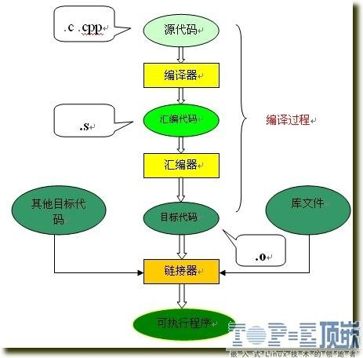
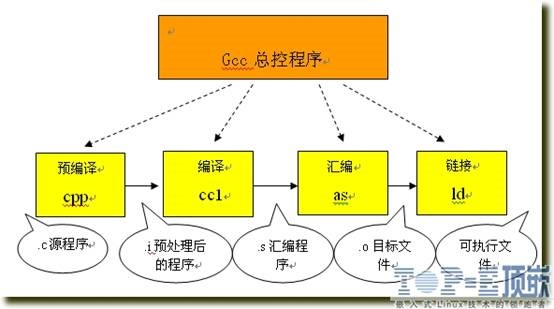
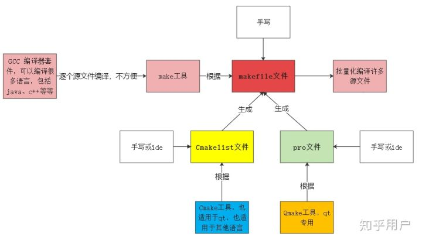

<!-- START doctoc generated TOC please keep comment here to allow auto update -->
<!-- DON'T EDIT THIS SECTION, INSTEAD RE-RUN doctoc TO UPDATE -->
**Table of Contents**  *generated with [DocToc](https://github.com/thlorenz/doctoc)*

- [知识储备](#%E7%9F%A5%E8%AF%86%E5%82%A8%E5%A4%87)
  - [开发工具](#%E5%BC%80%E5%8F%91%E5%B7%A5%E5%85%B7)
  - [MinGW、Cygwin、MSVC区别](#mingwcygwinmsvc%E5%8C%BA%E5%88%AB)
  - [编译过程](#%E7%BC%96%E8%AF%91%E8%BF%87%E7%A8%8B)
  - [make、Makefile、cmake、qmake](#makemakefilecmakeqmake)
  - [GCC、Clang和LLVM](#gccclang%E5%92%8Cllvm)
- [基础](#%E5%9F%BA%E7%A1%80)
  - [输入输出](#%E8%BE%93%E5%85%A5%E8%BE%93%E5%87%BA)
  - [命名空间](#%E5%91%BD%E5%90%8D%E7%A9%BA%E9%97%B4)
  - [预处理器](#%E9%A2%84%E5%A4%84%E7%90%86%E5%99%A8)
  - [异常处理](#%E5%BC%82%E5%B8%B8%E5%A4%84%E7%90%86)
- [数据类型](#%E6%95%B0%E6%8D%AE%E7%B1%BB%E5%9E%8B)
  - [整型](#%E6%95%B4%E5%9E%8B)
    - [sizeof运算符](#sizeof%E8%BF%90%E7%AE%97%E7%AC%A6)
    - [limits头文件](#limits%E5%A4%B4%E6%96%87%E4%BB%B6)
    - [无符号类型](#%E6%97%A0%E7%AC%A6%E5%8F%B7%E7%B1%BB%E5%9E%8B)
    - [十六进制和八进制表示](#%E5%8D%81%E5%85%AD%E8%BF%9B%E5%88%B6%E5%92%8C%E5%85%AB%E8%BF%9B%E5%88%B6%E8%A1%A8%E7%A4%BA)
  - [字符型](#%E5%AD%97%E7%AC%A6%E5%9E%8B)
  - [布尔型](#%E5%B8%83%E5%B0%94%E5%9E%8B)
  - [const关键字](#const%E5%85%B3%E9%94%AE%E5%AD%97)
  - [浮点型](#%E6%B5%AE%E7%82%B9%E5%9E%8B)
  - [auto关键字](#auto%E5%85%B3%E9%94%AE%E5%AD%97)
  - [字符串（c++的string类，c风格的见C语言）](#%E5%AD%97%E7%AC%A6%E4%B8%B2c%E7%9A%84string%E7%B1%BBc%E9%A3%8E%E6%A0%BC%E7%9A%84%E8%A7%81c%E8%AF%AD%E8%A8%80)
  - [结构体](#%E7%BB%93%E6%9E%84%E4%BD%93)
  - [共用体](#%E5%85%B1%E7%94%A8%E4%BD%93)
  - [枚举](#%E6%9E%9A%E4%B8%BE)
- [数据类型（二）](#%E6%95%B0%E6%8D%AE%E7%B1%BB%E5%9E%8B%E4%BA%8C)
  - [数组](#%E6%95%B0%E7%BB%84)
    - [c类型数组（不建议使用）](#c%E7%B1%BB%E5%9E%8B%E6%95%B0%E7%BB%84%E4%B8%8D%E5%BB%BA%E8%AE%AE%E4%BD%BF%E7%94%A8)
    - [模板类vector动态数组](#%E6%A8%A1%E6%9D%BF%E7%B1%BBvector%E5%8A%A8%E6%80%81%E6%95%B0%E7%BB%84)
    - [模板类array固定数组（c++11）](#%E6%A8%A1%E6%9D%BF%E7%B1%BBarray%E5%9B%BA%E5%AE%9A%E6%95%B0%E7%BB%84c11)
- [数据类型（三）对象[重点]](#%E6%95%B0%E6%8D%AE%E7%B1%BB%E5%9E%8B%E4%B8%89%E5%AF%B9%E8%B1%A1%E9%87%8D%E7%82%B9)
  - [类](#%E7%B1%BB)
  - [继承](#%E7%BB%A7%E6%89%BF)
  - [运算符重载](#%E8%BF%90%E7%AE%97%E7%AC%A6%E9%87%8D%E8%BD%BD)
  - [多态](#%E5%A4%9A%E6%80%81)
  - [抽象和接口](#%E6%8A%BD%E8%B1%A1%E5%92%8C%E6%8E%A5%E5%8F%A3)
- [高级](#%E9%AB%98%E7%BA%A7)
  - [文件处理](#%E6%96%87%E4%BB%B6%E5%A4%84%E7%90%86)
  - [模板](#%E6%A8%A1%E6%9D%BF)
  - [信号处理](#%E4%BF%A1%E5%8F%B7%E5%A4%84%E7%90%86)
  - [多线程](#%E5%A4%9A%E7%BA%BF%E7%A8%8B)

<!-- END doctoc generated TOC please keep comment here to allow auto update -->

# 知识储备

## 开发工具

+ [Dev C++](https://sourceforge.net/projects/dev-cpp/)

  Dev C++是一款用于C和C++语言开发的不错的IDE，它是一个开源的IDE，但只支持Windows平台，而不支持Linux和OS X。下载完就可以用，比较方便。

+ [CLion](https://www.jetbrains.com/clion/)

  CLion支持多平台，Window下需要配置环境，MinGW、Cygwin、MSVC、远程LInux服务器都可以进行配置

+ [Visual Studio](https://visualstudio.microsoft.com/)

  自带MSVC编译器

+ Qt

  和CLion有点类似			

## MinGW、Cygwin、MSVC区别

+ MinGW

  MinGW是指是Minimalist GNU on Windows的缩写。它是一个可自由使用和自由发布的Windows特定头文件和使用GNU工具集导入库的集合，允许你在GNU/Linux和Windows平台生成本地的Windows程序而不需要第三方C运行时库

+ Cygwin

  Cygwin 提供完整的类Unix 环境，Windows 用户不仅可以使用GNU 工具，理论上Linux 上的程序只要用Cygwin 重新编译，就可以在Windows 上运行

+ MSVC

  MSVC是指微软的VC编译器

## 编译过程





1. 预编译

   将.c 文件转化成 .i文件

   使用的gcc命令是：gcc –E

   对应于预处理命令cpp

2. 编译

   将.c/.h文件转换成.s文件

   使用的gcc命令是：gcc –S

   对应于编译命令 cc –S

3. 汇编

   将.s 文件转化成 .o文件

   使用的gcc 命令是：gcc –c

   对应于汇编命令是 as

4. 链接

   将.o文件转化成可执行程序

   使用的gcc 命令是： gcc

   对应于链接命令是 ld

   总结起来编译过程就上面的四个过程：预编译处理(.c) －－> 编译、优化程序（.s、.asm）－－> 汇编程序(.obj、.o、.a、.ko) －－> 链接程序（.exe、.elf、.axf等）

## make、Makefile、cmake、qmake



autotools,cmake,qmake 用来生成Makefile。make用来执行Makefile

+ make和Makefile

  make 是用来执行Makefile的

  Makefile是类unix环境下(比如Linux)的类似于批处理的"脚本"文件。其基本语法是: **目标+依赖+命令**，只有在**目标**文件不存在，或**目标**比**依赖**的文件更旧，**命令**才会被执行。由此可见，Makefile和make可适用于任意工作，不限于编程。比如，可以用来管理latex

+ cmake

  cmake是跨平台项目管理工具，它用更抽象的语法来组织项目。它CMakeLists.txt文件（学名：组态档）去生成makefile。

+ qmake

  qmake是Qt专用的项目管理工具，对应的工程文件是*.pro

## GCC、Clang和LLVM

+ GCC

​        GCC（GNU Compiler Collection，GNU编译器套装），是一套由 GNU 开发的编程语言编译器。

+ Clang

​        一种编译器，类似于GCC，但编译Objective-C语言时，比GCC快3倍之多！支持C家族语言：C,C++,Objective-C, Objective-C++等。

+ LLVM

(low level virtual machine)优化代码，优化：编译时间，链接时间，运行时间，空闲优化。 它是构架编译器的框架系统，用于优化使用任何语言编写的程序。

LLVM是一个project ,包含许多组件。 包含许多把中间代码转为obj文件的工具、库、头文件。 包含汇编器、反汇编器、bitcode分析器和bitcode优化器。也包含基本的回归测试。

- 相关性：

Clang编译C家族语言到LLVM bitcode , 然后再用LLVM转为obj文件。

非常酷的一点，支持任何平台！！！

# 基础

## 输入输出

```c++
#include <iostream>  //C++输入输出的库,没有.h后缀，与c的区别
using namespace std;  //使用输入输出的命名空间

int main() {
    int a;
    cin >> a;  //cin为输入函数
    cout << "输入的数为：" << a << endl;   //cout为输出函数，endl为换行符
    return 0;
}
```

## 命名空间

## 预处理器

## 异常处理


# 数据类型

## 整型

short、int、long、long long

- short至少16位
- int至少与short一样长
- long至少32位，至少与int一样长
- long long至少64位，至少与long一样长

### sizeof运算符

可对类型名或者变量名使用sizeof运算符，输出字节数。

```c++
int a = 0;
cout << sizeof(a) << endl;  
//输出4，表示变量a占四个字节
```

### limits头文件

包含当前操作系统下的最大值和最小值

```c++
#include <limits>   //头文件

using namespace std;  //使用输入输出的命名空间

int main() {
    cout << INT_MAX << endl;  //输出int类型在当前的最大值
    return 0;
}
```

### 无符号类型

无符号类型只有在非负数情况下才可以使用

unsigned short、unsigned（表示无符号int整形）、unsigned long、unsigned long long

### 十六进制和八进制表示

```c++
int a=0x16;   //这边的16为十六进制
int b=016;    //这边的16为八进制
```

## 字符型

存储0~128个ASCII码

c++11 新增char16_t和char32_t

## 布尔型

true和false。true为1，false为0

## const关键字

使用const来代替define声明常量。

## 浮点型

float、double、long double

## auto关键字

```c++
auto a = 'a';   //不显示的指明类型，使用auto关键字系统会自动识别
```

## 字符串（c++的string类，c风格的见C语言）

```c++
#include <iostream>  //C++输入输出的库,没有.h后缀，与c的区别
#include <string>  //c++风格的字符串头文件

using namespace std;  //使用输入输出的命名空间

int main() {
    string str1 = "Hello";  //c++的字符串类使用小写的string表示
    string str2 = "World";
    string str3;
    int  len ;

    str3 = str1;  //字符串的复制
    cout << "str3 : " << str3 << endl;

    str3 = str1 + str2;  //字符串的拼接
    cout << "str1 + str2 : " << str3 << endl;

    len = str3.size();  //字符串的长度
    cout << "str3.size() :  " << len << endl;
}
```

## 结构体

## 共用体

## 枚举

# 数据类型（二）

## 数组

```c++
共同点
（1.）都和数组相似，都可以使用标准数组的表示方法来访问每个元素（array和vector都对下标运算符[ ]进行了重载）
（2.）三者的存储都是连续的，可以进行随机访问
不同点
（0.）数组是不安全的，array和vector是比较安全的（有效的避免越界等问题）
（1.）array对象和数组存储在相同的内存区域（栈）中，vector对象存储在自由存储区（堆）
（2.）array可以将一个对象赋值给另一个array对象，但是数组不行
（3.）vector属于变长的容器，即可以根据数据的插入和删除重新构造容器容量；但是array和数组属于定长容器
（4.）vector和array提供了更好的数据访问机制，即可以使用front()和back()以及at()（at()可以避免a[-1]访问越界的问题）访问方式，使得访问更加安全。而数组只能通过下标访问，在写程序中很容易出现越界的错误
（5.）vector和array提供了更好的遍历机制，即有正向迭代器和反向迭代器
（6.）vector和array提供了size()和Empty()，而数组只能通过sizeof()/strlen()以及遍历计数来获取大小和是否为空
（7.）vector和array提供了两个容器对象的内容交换，即swap()的机制，而数组对于交换只能通过遍历的方式逐个交换元素
（8.）array提供了初始化所有成员的方法fill（）
（9.）由于vector的动态内存变化的机制，在插入和删除时，需要考虑迭代的是否有效问题
（10.）vector和array在声明变量后，在声明周期完成后，会自动地释放其所占用的内存。对于数组如果用new[ ]/malloc申请的空间，必须用对应的delete[ ]和free来释放内存
```

### c类型数组（不建议使用）

```c++
#include <iostream>  //C++输入输出的库,没有.h后缀，与c的区别
using namespace std;  //使用输入输出的命名空间

int main() {
    int n[10]; // n 是一个包含 10 个整数的数组

    // 初始化数组元素
    for (int i = 0; i < 10; i++) {
        n[i] = i + 100; // 设置元素 i 为 i + 100
        cout << n[i] << endl;
    }
}
```

### 模板类vector动态数组

```c++
/**
有点类似于Java的ArrayList集合类

1.push_back 在数组的最后添加一个数据
2.pop_back 去掉数组的最后一个数据
3.at 得到编号位置的数据
4.begin 得到数组头的指针
5.end 得到数组的最后一个单元+1的指针
6．front 得到数组头的引用
7.back 得到数组的最后一个单元的引用
8.max_size 得到vector最大可以是多大
9.capacity 当前vector分配的大小
10.size 当前使用数据的大小
11.resize 改变当前使用数据的大小，如果它比当前使用的大，者填充默认值
12.reserve 改变当前vecotr所分配空间的大小
13.erase 删除指针指向的数据项
14.clear 清空当前的vector
15.rbegin 将vector反转后的开始指针返回(其实就是原来的end-1)
16.rend 将vector反转构的结束指针返回(其实就是原来的begin-1)
17.empty 判断vector是否为空
18.swap 与另一个vector交换数据
**/
#include <iostream>  //C++输入输出的库,没有.h后缀，与c的区别
#include <vector>  //vector的头文件

using namespace std;  //使用输入输出的命名空间

int main() {
    vector<int> obj; //创建一个向量存储容器 int
    for (int i = 0; i < 10; i++)  // push_back(elem)在数组最后添加数据
    {
        obj.push_back(i);
        cout << obj[i] << ",";
    }
    for (int i = 0; i < 5; i++)//去掉数组最后一个数据
    {
        obj.pop_back();
    }
    cout << "\n" << endl;
    for (int i = 0; i < obj.size(); i++) //size()容器中实际数据个数
    {
        cout << obj[i] << ",";
    }
    return 0;
}
```

### 模板类array固定数组（c++11）

```c++
#include <array>    //array类头文件

using namespace std;  //使用array需要包含该命名空间

int main() {
    array<int, 5> ai{};    // create array object of 5 ints
    array<double, 4> ad = {1.2, 2.1, 3.43, 4.3};    // 使用普通方式进行初始化
    array<double, 4> ad2{1.2, 2.1, 3.43, 4.3};    // 使用列表的方式进行初始化
}
```

# 数据类型（三）对象[重点]

##  类

```c++
/**
掌握目标：
1、构造函数/析构函数
2、复制构造函数
3、this指针
4、类指针
5、友元函数(有啥用？？？？)
6、内联函数
7、静态成员static关键字

//特殊成员变量初始化
常量变量：必须通过构造函数参数列表进行初始化。
引用变量：必须通过构造函数参数列表进行初始化。
普通静态变量：要在类外通过"::"初始化。
静态整型常量：可以直接在定义的时候初始化。
静态非整型常量：不能直接在定义的时候初始化。要在类外通过"::"初始化
**/
//头文件
#include <iostream>

#ifndef TWOC_PERSON_H
#define TWOC_PERSON_H

using namespace std;

class Person {
public:   //     公有的数据成员和成员函数
    static int count;   //记录构造函数次数,构造static变量

    Person();   //无参构造函数
    ~Person();  //析构函数，
    Person(string food);  //有参构造函数
    Person(string food, string time);

    Person(const Person &person);   //复制构造函数，复制对象用的,深拷贝和浅拷贝
    void eat();   //成员函数

    static int getCount();    //静态函数

private:   //私有的数据成员和成员函数
    string foodName;
    string currentTime;

protected:  //保护的数据成员和和成员函数
};
#endif //TWOC_PERSON_H

//实现文件
#include "Person.h"

int Person::count = 0;   // 初始化类 Box 的静态成员，其实是定义并初始化的过程(必须在类外进行)

void Person::eat() {
    cout << "我正在吃:" << foodName << endl;
}

//初始化列表来进行初始化数据,可以使用默认参数
Person::Person(string food, string time = "now") : foodName(food), currentTime(time) {
    count++;
}

Person::Person(const Person &person) {

}

Person::~Person() {
    cout << "~Person()" << endl;
}

Person::Person() {
    cout << "Person()" << endl;
}

int Person::getCount() {
    return count;
}

//调用
#include <iostream>
#include "Person.h"
#include <string>
int main(int argc, const char * argv[]) {

    
    Person *person1=new Person("汉堡包");   //堆上面分配内存
    person1->eat();
    delete person1;   //需要主动释放内存，会调用析构函数
    
    Person person("薯条");   //栈上面创建对象，程序结束会自动回收内存，然后自动调用析构函数
    person.eat();
    cout << "Total objects: " << Person::count << endl;        //输出2
    cout << "Total objects: " << Person::getCount() << endl;   //输出2

    return 0;
}
```

## 继承

```c++
/**
子类继承了父类所有方法（public和protected）下列除外
基类的构造函数、析构函数和拷贝构造函数。
基类的重载运算符。
基类的友元函数。
**/

//父类
#ifndef TWOC_SHAPE_H
#define TWOC_SHAPE_H
class Shape {
public:
    void setWidth(int w);

    void setHeight(int h);

protected:
    int width;
    int height;
};
#endif //TWOC_SHAPE_H

#include "Shape.h"

void Shape::setWidth(int w) {
    width = w;
}

void Shape::setHeight(int h) {
    height = h;
}

//子类
#ifndef TWOC_RECTANGLE_H
#define TWOC_RECTANGLE_H
#include "Shape.h"

class Rectangle : public Shape {

public:
    int getArea();
};
#endif //TWOC_RECTANGLE_H

#include "Rectangle.h"

int Rectangle::getArea() {
    return (width * height);
}

//main方法
#include <iostream>
#include "Rectangle.h"

using namespace std;

int main() {

    Rectangle Rect;

    Rect.setWidth(5);
    Rect.setHeight(7);
    cout << "Total area: " << Rect.getArea() << endl;   //输出35
    return 0;
}
```

## 运算符重载

```c++
/**
Box operator+(const Box&);  //成员函数定义
Box operator+(const Box&, const Box&);  //非成员函数定义

可重载的运算符
双目算术运算符	+ (加)，-(减)，*(乘)，/(除)，% (取模)
关系运算符	==(等于)，!= (不等于)，< (小于)，> (大于>，<=(小于等于)，>=(大于等于)
逻辑运算符	||(逻辑或)，&&(逻辑与)，!(逻辑非)
单目运算符	+ (正)，-(负)，*(指针)，&(取地址)
自增自减运算符	++(自增)，--(自减)
位运算符	| (按位或)，& (按位与)，~(按位取反)，^(按位异或),，<< (左移)，>>(右移)
赋值运算符	=, +=, -=, *=, /= , % = , &=, |=, ^=, <<=, >>=
空间申请与释放	new, delete, new[ ] , delete[]
其他运算符	()(函数调用)，->(成员访问)，,(逗号)，[](下标)
**/

#include <iostream>

using namespace std;

class Box {
public:

    double getVolume(void) {
        return length * breadth * height;
    }

    void setLength(double len) {
        length = len;
    }

    void setBreadth(double bre) {
        breadth = bre;
    }

    void setHeight(double hei) {
        height = hei;
    }

    // 重载 + 运算符，用于把两个 Box 对象相加
    Box operator+(const Box &b) {
        Box box;
        box.length = this->length + b.length;
        box.breadth = this->breadth + b.breadth;
        box.height = this->height + b.height;
        return box;
    }

private:
    double length;      // 长度
    double breadth;     // 宽度
    double height;      // 高度
};

// 程序的主函数
int main() {
    Box Box1;                // 声明 Box1，类型为 Box
    Box Box2;                // 声明 Box2，类型为 Box
    Box Box3;                // 声明 Box3，类型为 Box
    double volume = 0.0;     // 把体积存储在该变量中

    Box1.setLength(6.0);
    Box1.setBreadth(7.0);
    Box1.setHeight(5.0);

    Box2.setLength(12.0);
    Box2.setBreadth(13.0);
    Box2.setHeight(10.0);

    volume = Box1.getVolume();
    cout << "Volume of Box1 : " << volume << endl;  //输出210

    volume = Box2.getVolume();
    cout << "Volume of Box2 : " << volume << endl;  //输出1560

    Box3 = Box1 + Box2;    //使用重载运算符将两个对象相加,执行operator+方法
    volume = Box3.getVolume();
    cout << "Volume of Box3 : " << volume << endl;  //输出5400

    return 0;
}
```

## 多态

```c++
/**
虚函数：使用virtual关键字
静态链接和动态链接
**/
```

## 抽象和接口

```
/**
纯虚函数：  virtual double area() = 0;   //不定义任何方法体

抽象类：
其实，在c++中并没有抽象类的概念，要实现抽象类则需要通过纯虚函数实现。纯虚函数指的是只定义函数原型的成员函数。在c++的类中，只要存在纯虚函数，那么该类就变成抽象类。

 (1) 每个具体图形的求面积算法不一样，所以加上virtual关键字，表明该函数是虚函数，在子类中重写时可以发生多态； 
 (2) 为对Shape类求面积无意义，所以加上”= 0”表明该函数声明为纯虚函数，不需要定义函数体。 
 (3) 抽象类不能生成对象，只能用作父类被继承，子类必须实现纯虚函数的具体功能，在子类中，父类的纯虚函数被实现后就变成虚函数，当然，如果子类没有实现父类的纯虚函数，那么子类也是抽象类一个

接口：
c++中接口也是一种抽象类，需要满足： 
 (1) 类中没有定义任何成员变量 
 (2) 类中所有成员函数都是公有且都是纯虚函数
**/
```

# 高级

## 文件处理

```c++
/**
ofstream	该数据类型表示输出文件流，用于创建文件并向文件写入信息。
ifstream	该数据类型表示输入文件流，用于从文件读取信息。
fstream	该数据类型通常表示文件流，且同时具有 ofstream 和 ifstream 两种功能，这意味着它可以创建文件，向文件写入信息，从文件读取信息。

void open(const char *filename, ios::openmode mode);   //打开文件标准模式

mode:
ios::app	追加模式。所有写入都追加到文件末尾。
ios::ate	文件打开后定位到文件末尾。
ios::in	打开文件用于读取。
ios::out	打开文件用于写入。
ios::trunc	如果该文件已经存在，其内容将在打开文件之前被截断，即把文件长度设为 0。

void close();  //关闭文件
**/
//读写文件需要用到的
#include <fstream>
#include <iostream>

//<io.h>中的_access可以判断文件是否存在
#include <io.h>
//<direct.h>中的_mkdir可以创建文件
#include <direct.h>

using namespace std;

int main() {

    char data[100];

    string path = R"(C:\Users\jacky\Desktop\sd)";    //字符串前面加个R表示不需要转义,文件不存在则会创建，默认为写入模式,覆盖模式
    if (_access(path.c_str(), 0) == -1)    //如果文件夹不存在
        _mkdir(path.c_str());                //则创建
    // 以写模式打开文件
    ofstream outfile;
    outfile.open(R"(C:\Users\jacky\Desktop\sd\a.txt)");

    cout << "Writing to the file" << endl;
    cout << "Enter your name: ";
    cin.getline(data, 100);

    // 向文件写入用户输入的数据
    outfile << data << endl;

    cout << "Enter your age: ";
    cin >> data;
    cin.ignore();

    // 再次向文件写入用户输入的数据
    outfile << data << endl;

    // 关闭打开的文件
    outfile.close();

    // 以读模式打开文件
    ifstream infile;
    infile.open(R"(C:\Users\jacky\Desktop\sd\a.txt)");

    cout << "Reading from the file" << endl;
    infile >> data;

    // 在屏幕上写入数据
    cout << data << endl;

    // 再次从文件读取数据，并显示它
    infile >> data;
    cout << data << endl;

    // 关闭打开的文件
    infile.close();

    return 0;
}
```

## 模板

## 信号处理

## 多线程

