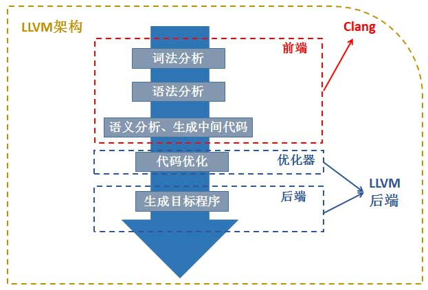

<!-- START doctoc generated TOC please keep comment here to allow auto update -->
<!-- DON'T EDIT THIS SECTION, INSTEAD RE-RUN doctoc TO UPDATE -->
**Table of Contents**  *generated with [DocToc](https://github.com/thlorenz/doctoc)*

- [前置知识](#%E5%89%8D%E7%BD%AE%E7%9F%A5%E8%AF%86)
  - [NDK](#ndk)
  - [ndk-build](#ndk-build)
  - [CMake](#cmake)
  - [两种生成so方式](#%E4%B8%A4%E7%A7%8D%E7%94%9F%E6%88%90so%E6%96%B9%E5%BC%8F)
  - [ABI](#abi)
  - [LLVM和Clang](#llvm%E5%92%8Cclang)
  - [动态库和静态库](#%E5%8A%A8%E6%80%81%E5%BA%93%E5%92%8C%E9%9D%99%E6%80%81%E5%BA%93)
- [基础](#%E5%9F%BA%E7%A1%80)
  - [JNIEnv类型](#jnienv%E7%B1%BB%E5%9E%8B)
  - [jobject参数obj](#jobject%E5%8F%82%E6%95%B0obj)
  - [jclass类型](#jclass%E7%B1%BB%E5%9E%8B)
  - [jfieldId和jmethodId](#jfieldid%E5%92%8Cjmethodid)
  - [jstring](#jstring)
  - [jni调用java代码](#jni%E8%B0%83%E7%94%A8java%E4%BB%A3%E7%A0%81)

<!-- END doctoc generated TOC please keep comment here to allow auto update -->

# 前置知识

## NDK

​      NDK 工具包中提供了完整的一套将 c/c++ 代码编译成静态/动态库的工具，而 Android.mk 和 Application.mk 你可以认为是描述编译参数和一些配置的文件。比如指定使用c++11还是c++14编译，会引用哪些共享库，并描述关系等，还会指定编译的 abi。只有有了这些 NDK 中的编译工具才能准确的编译 c/c++ 代码。

## ndk-build

​      ndk-build 文件是 Android NDK r4 中引入的一个 shell 脚本。其用途是调用正确的 NDK 构建脚本。其实最终还是会去调用 NDK 自己的编译工具。

## CMake

​       c/c++ 的编译文件在不同平台是不一样的。Unix 下会使用 makefile 文件编译，Windows 下会使用 project 文件编译。而 CMake 则是一个跨平台的编译工具，它并不会直接编译出对象，而是根据自定义的语言规则（CMakeLists.txt）生成 对应 makefile 或 project 文件，然后再调用底层的编译。

## 两种生成so方式

​      在 Android Studio 2.2 之后你有2种选择来编译你写的 c/c++ 代码。

​      1、 ndk-build + Android.mk + Application.mk 组合

​      2、CMake + CMakeLists.txt 组合。

​      这2个组合与Android代码和c/c++代码无关，只是不同的构建脚本和构建命令。本篇文章主要会描述后者的组合。（也是Android现在主推的）

## ABI

​       ABI（Application binary interface）应用程序二进制接口。不同的CPU 与指令集的每种组合都有定义的 ABI (应用程序二进制接口)，一段程序只有遵循这个接口规范才能在该 CPU 上运行，所以同样的程序代码为了兼容多个不同的CPU，需要为不同的 ABI 构建不同的库文件。当然对于CPU来说，不同的架构并不意味着一定互不兼容

​       armeabi设备只兼容armeabi；

​       armeabi-v7a设备兼容armeabi-v7a、armeabi；

​       arm64-v8a设备兼容arm64-v8a、armeabi-v7a、armeabi；

​       X86设备兼容X86、armeabi；

​       X86_64设备兼容X86_64、X86、armeabi；

​       mips64设备兼容mips64、mips；

​       mips只兼容mips；

## LLVM和Clang

​       Android NDK从r13起，默认使用Clang进行编译。但是暂时也没有把GCC删掉，Google会一直等到libc++（Clang的c++标准库实现）足够稳定后删掉GCC。。。



## 动态库和静态库

​     1、静态库 

静态库即静态链接库（Windows 下的 .lib，Linux 和 Mac 下的 .a）。之所以叫做静态，是因为静态库在编译的时候会被直接拷贝一份，复制到目标程序里，这段代码在目标程序里就不会再改变了。 

静态库的好处很明显，编译完成之后，库文件实际上就没有作用了。目标程序没有外部依赖，直接就可以运行。当然其缺点也很明显，就是会使用目标程序的体积增大。 

​     2、动态库 

动态库即动态链接库（Windows 下的 .dll，Linux 下的 .so，Mac 下的 .dylib）。与静态库相反，动态库在编译时并不会被拷贝到目标程序中，目标程序中只会存储指向动态库的引用。等到程序运行时，动态库才会被真正加载进来。 

动态库的优点是，不需要拷贝到目标程序中，不会影响目标程序的体积，而且同一份库可以被多个程序使用（因为这个原因，动态库也被称作共享库）。同时，编译时才载入的特性，也可以让我们随时对库进行替换，而不需要重新编译代码。动态库带来的问题主要是，动态载入会带来一部分性能损失，使用动态库也会使得程序依赖于外部环境。如果环境缺少动态库或者库的版本不正确，就会导致程序无法运行（Linux 下喜闻乐见的 lib not found 错误）

# 基础

## JNIEnv类型

​       JNIEnv类型实际代表了Java上下文环境，c++中可以使用JNIEnv* 指针就可以对Java端的代码进行操作。如，创建Java中的对象，调用Java的方法，获取Java的属性等。（**相关方法可以查看jni.h**）

```java
1.NewObject    创建Java的对象
2.NewString     创建Java中的字符串对象
3.New<Type>Array   创建类型为Type的数组对象
4.Get<Type>Field     获取类型为Type的字段
5.Set<Type>Field     设置类型为Type的字段
6.GetStatic<Type>Field  获取类型为Type的静态字段
7.SetStatic<Type>Field  设置类型为Type的静态字段
8.Call<Type>Method      调用类型为Type的方法
9.CallStatic<Type>Method   调用类型为Type的静态方法
10.CallNonbvirtualMethod   调用非虚方法（java多态默认都实现了虚方法，默认都会调用子类方法，这个方法实现多态下调用父类的方法）
```

## jobject参数obj

```java
表示Java的Object类型，创建Java对象

1.如果native方法不是static，obj就表示native方法的类实例

2.如果native方法是static，obj就代表native方法的类的class对象实例

第一种方法创建Java对象：
jobject  NewObject(jclass clazz，jmethodID methodID，.......)
clazz：Java对象Class对象
methodID：构造方法名（方法名始终为“<init>’）
第三个参数：构造函数参数签名    无参构造始终为（”()V“）
```

## jclass类型

```java
表示Java中的Class类
获取jclass
1.jclass FindClass(const char* clsName):通过类的名称（类的全名，这时候包名用/来区分）来获取
 如：jclass str=env->FindClass("java/lang/String")  //获取Java中的String对象
2.jclass GetObjectClass(Jobject obj):通过对象实例来获取jclass，相当于Java中的getClass方法
3.jcass  GetSuperClass(jclass obj):通过jclass可以其父类的jclass对象
```

## jfieldId和jmethodId

```java
需要调用Java方法的字段和方法，必须先获取Java属性的jfieldId和jmethodId
使用JNIEnv的如下方法：
GetFieldID/GetMethodID
GetStaticFieldID/GetStaticMethodID
GetFieldID方法：
jfieldID GetFieldID(jclass clazz, const char* name, const char* sig)
clazz：表示依赖的类对象的class对象
name：字段的名称
sign：字段/方法签名（查看签名 javap -s <options> className）
1.普通类型签名：
boolean Z
byte    B
char    C
short   S
long    L
float   F
double  D
void    V
2、引用类型签名
object     L开头，然后以/ 分隔包的完整类型，后面再加；   比如说String    签名就是   **Ljava/lang/String;（后面必须跟分号）**
Array      以[ 开头，在加上数组元素类型的签名，比如int[]   签名就是[I ，在比如int[][] 签名就是[[I ，object数组签名就是[Ljava/lang/Object;
3、方法签名
(参数1类型签名 参数2类型签名 参数3类型签名  .......)返回值类型签名
 还要注意，就算java构造器没返回值，也加上V签名
```

## jstring

```java
Java中String对象是Unicode（UTF-16）码，每个字符无论是中文还是英文还是符号，一个字符总是占两个字节。
Java通过JNI接口可以将字符串转换为C/C++中的宽字符串(wchar_t*)，或传回一个UTF-8的字符串(char *)到C/C++，反过来也是一样的。
JNIEnv方法介绍：
1.获取字符串长度
jsize  GetStringLength(jstring j_msg)
2.将jstring对象拷贝到const jchar*指针字符串中
void GetStringRegion(jstring str, jsize start, jsize len, jchar* buf)       //拷贝Java字符串并以UTF-8编码传入jstr
void GetStringUTFRegion(jstring str, jsize start, jsize len, jchar* buf)   //拷贝Java字符串并以UTF-16编码传入jstr
3.生成jstring对象
jobject NewString(const jchar* jstr，int size)
```

## jni调用java代码

[数组变量调用](https://blog.csdn.net/riskychengallesgut/article/details/80465957)

```java
//调用java的静态方法
java代码
byte[] bytes = Base64.decode(all, Base64.NO_WRAP);
jni代码
//使用反射来获取java方法
jclass base64class = env->FindClass("android/util/Base64");
jmethodID base64methode = env->GetStaticMethodID(base64class, "decode",
                                                 "(Ljava/lang/String;I)[B");
jstring str = env->NewStringUTF(all);
//调用静态方法使用的是jclass，而不是jobject
jbyteArray jobject1 = (jbyteArray) env->CallStaticObjectMethod(base64class, base64methode, str,
                                                               2);
jsize jsize1 = env->GetArrayLength(jobject1);   //获取通过base64加密的字节数组的长度
jboolean isCopy = false;
char *dataNatives = (char *) env->GetByteArrayElements(jobject1,
                                                       &isCopy);  //获取通过base64加密的字节数组
```

​       