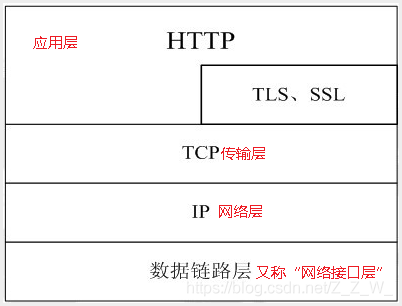
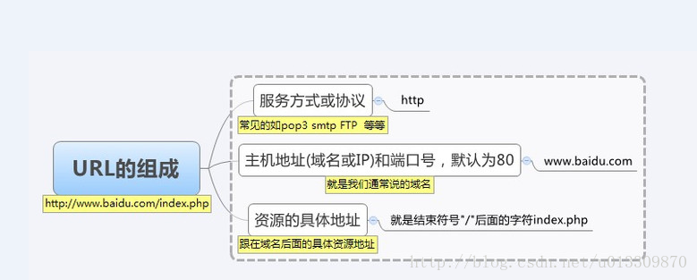
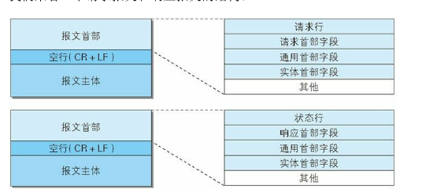

# [HTTP](https://segmentfault.com/a/1190000015969377)
## 简介
HTTP是一个属于应用层的面向对象的协议，由于其简捷、快速的方式，适用于分布式超媒体信息系统。它于1990年提出，经过几年的使用与发展，得到不断地完善和扩展。在Internet中所有的传输都是通过TCP/IP进行的。HTTP协议作为TCP/IP模型中应用层的协议也不例外。HTTP协议通常承载于TCP协议之上，有时也承载于TLS或SSL协议层之上，这个时候，就成了我们常说的HTTPS。如下图所示：

## 主要特点
- 支持C/S（客户/服务器）模式。
- 简单快速：客户向服务器请求服务时，只需传送请求方法和路径。
请求方法常用的有GET、HEAD、POST，每种方法规定了客户与服务器联系的类型不同。
由于HTTP协议简单，使得HTTP服务器的程序规模小，因而通信速度很快。
- 灵活：HTTP允许传输任意类型的数据对象。正在传输的类型由Content-Type加以标记。
- 无连接：无连接的含义是限制每次连接只处理一个请求。
服务器处理完客户的请求，并收到客户的应答后，即断开连接。
采用这种方式可以节省传输时间。
- 无状态：HTTP协议是无状态协议，无状态是指协议对于事务处理没有记忆能力。
缺少状态意味着如果后续处理需要前面的信息，则它必须重传，这样可能导致每次连接传送的数据量增大。另一方面，在服务器不需要先前信息时它的应答就较快。

## URL介绍
在说HTTP协议之前必须要先了解URL（统一资源定位符）统一资源定位符是对可以从互联网上得到的资源的位置和访问方法的一种简洁的表示，是互联网上标准资源的地址。互联网上的每个文件都有一个唯一的URL，它包含的信息指出文件的位置以及浏览器应该怎么处理它。

基本URL包含模式（或称协议）、服务器名称（或IP地址）、路径和文件名，如“协议://授权/路径?查询”。完整的、带有授权部分的普通统一资源标志符语法看上去如下：协议://用户名:密码@子域名.域名.顶级域名:端口号/目录/文件名.文件后缀?参数=值#标志

第一部分

模式/协议（scheme）：它告诉浏览器如何处理将要打开的文件。最常用的模式是超文本传输协议（Hypertext Transfer Protocol，缩写为HTTP），这个协议可以用来访问网络。其他协议如下：

http——超文本传输协议资源

https——用安全套接字层传送的超文本传输协议

ftp——文件传输协议

mailto——电子邮件地址

ldap——轻型目录访问协议搜索

file——当地电脑或网上分享的文件

news——Usenet新闻组

gopher——Gopher协议

telnet——Telnet协议

第二部分

文件所在的服务器的名称或IP地址，后面是到达这个文件的路径和文件本身的名称。服务器的名称或IP地址后面有时还跟一个冒号和一个端口号。它也可以包含接触服务器必须的用户名称和密码。路径部分包含等级结构的路径定义，一般来说不同部分之间以斜线（/）分隔。询问部分一般用来传送对服务器上的数据库进行动态询问时所需要的参数。

## 报文
用于HTTP协议交互的信息被称为HTTP报文.请求端(客户端)的HTTP报文称为请求报文,响应端(服务器端)的HTTP报文称为响应报文,HTTP报文本身是由多个数据构成的字符串文本.

HTTP报文可分为报文首部和报文实体两块,二者由最初的空行来划分,通常,并不一定由报文主体。

### 请求报文和响应报文的结构

+ 请求行(包含用于请求的方法,请求URI和HTTP版本)
+ 状态行(包含表明响应结果的状态码,原因短句和HTTP版本)
+ [首部字段(包含请求和响应的的各种条件和属性的各类首部)](https://blog.csdn.net/alexshi5/article/details/80379086)

# 一次HTTP请求的解析
## 参考文字
+ https://blog.csdn.net/u013777975/article/details/80496121（DNS解析过程很详细）
+ https://www.jianshu.com/p/ed5735c663d7

给一个简单的实例来看看http协议的执行过程上图中用户点击了一个链接指向清华大学院系设置的页面，其URL是http://www.tsinghua.edu.cn/chn/yxsz/index.htm用http/1.0更具体的说明用户在点击鼠标后发生的事件：

（1）浏览器分析链接指向页面的URL。

（2）浏览器向DNS请求解析http://www.tsinghua.edu.cn的IP地址。

（3）域名系统DNS解析出清华大学的IP地址为166.111.4.100。

（4）浏览器与服务器建立TCP连接（服务器的IP地址是166.111.4.100，端口号是80）。

（5）浏览器发出取文件命令：GET/chn/yxsz/index.htm。

（6）服务器http://www.tsinghua.edu.cn做出响应，把文件index.htm发送给浏览器。

（7）释放TCP连接。

（8）浏览器显示“清华大学院系设置”文件index.htm中的所有文件。

# [HTTPS](https://blog.csdn.net/xiaoming100001/article/details/81109617)
## HTTP的缺点
+ 通信使用明文(不加密),内容可能会被窃听
+ 不验证通信方的身份,可能被伪装
+ 无法验证报文的完整性,可能被篡改